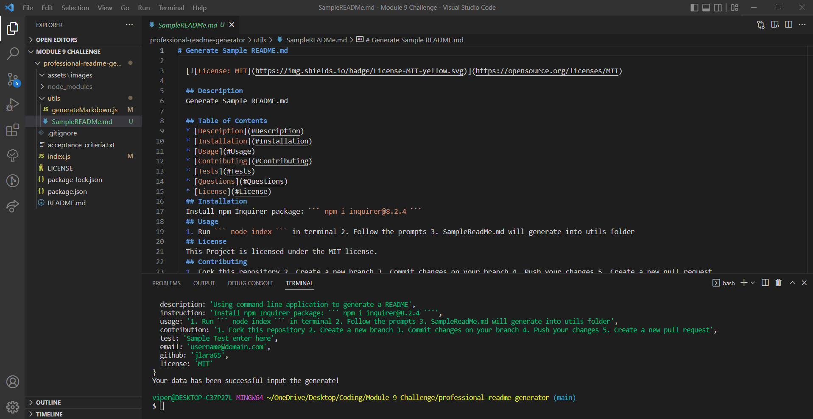

# professional-readme-generator

[](https://opensource.org/licenses/MIT)

## Description
Using `node` command line application to generates a professional README.

## Table of Contents
* [Installation](#Installation)
* [Usage](#Usage)
* [Contributing](#Contributing)
* [Questions](#Questions)
* [License](#License)

## Installation
Requires the npm Inquirer package:  
```bash 
npm i inquirer@8.2.4
```

## Usage
--> [Walkthrough Video](https://watch.screencastify.com/v/TaqNLbtUBKHwdaYD9yr6) <--

1. Run `node index` in terminal
2. Follow the prompts 
3. A file name `SampleReadMe.md` will be generated in utils folder


## Contributing 

1. Fork this repository 
2. Create a new branch
3. Commit changes on your branch
4. Push your changes
5. Create a new pull request

## Questions
If you have any questions or would like to report the issues in this project, please feel free to contact me at  email_to_be_annouced@domain.com

## License
This project is licensed under the [MIT](./LICENSE)

&copy; 2022 Joseph Lara